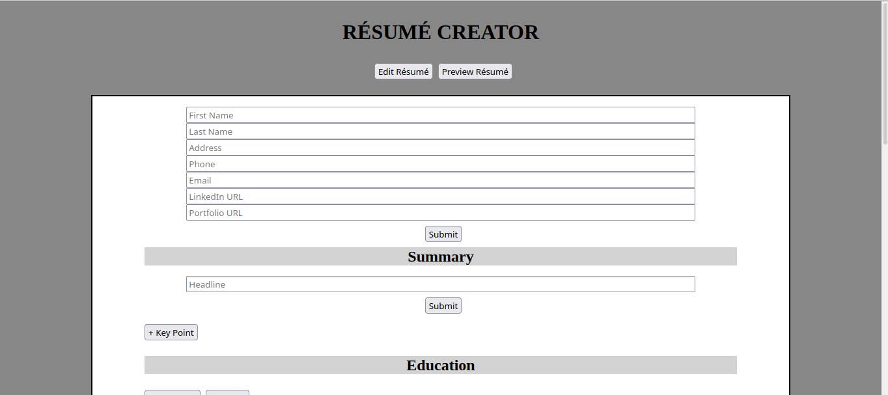

# Readme
# React Resume Creator

## Overview

My first ever React project.  A resume creator that shows you the appearance 
of the resume as formatted to be printed while you are editting it.

### Challenge

The full requirements for the project from the Odin Project curriculum can be seen [here](https://www.theodinproject.com/paths/full-stack-javascript/courses/javascript/lessons/cv-application).  

### Screenshot

  

### Links

- [Live site](https://mattdimicelli.github.io/cv-project/)
- [Repo](https://github.com/mattdimicelli/cv-project)

## My process

### Built with
- React, with JS classes for stateful components
- JSX
- create-react-app
- Uniqid library to create unique IDs for list rendering
- CSS

### What I learned

Since this was my first React project, I obviously learned a lot just to be 
able to pull this off.  First of all, the basics about React itself: it is
a library (not a framework) for building UI components.  It is declarative,
which means that you tell it what you want (as opposed to how to do it step-by-step
), and React builds it.

JSX, which stands for JS XML, is not the same thing as HTML, even though the
terms are often used interchangeably in the React context.  JSX elements are
syntactic sugar for React.createElement()... which certaintly isn't as elegant.

I learned that both class components and functional components can be stateful,
but only class components can do so without using Hooks.  Although foregoing
the class components in favor of functional components is now the preferred method,
I built this app using class components because much code in the wild still uses
class components, so I have to know how to use them.  

I then learned the process of "thinking in React".  Step #1 is to break the UI
down into a component heiarchy.  The heiarchy is important because data should flow
in one direction in React.  Step #2 involves building a static-only version
of the site in React.  So only props, no state.  The only lifecycle methods that
the components will have at this point are the render() methods.  You can start 
building from the bottom-up, or vice-versa.  Starting at the bottom-up is better
for large, complex projects, while starting at the top is easier for simpler 
projects.  I chose to start at the top since this project is relatively simple.  
By the end of this step, you have reusable components that render your data model.
Step #3: Identify the minimal (keep as DRY as possible) representation of UI state
for your application.  You have to consider all the pieces of data, and ask yourself
three questions about each one: 
    1.  Is in passed in from a parent via a prop?  If so, it probably isn't state.
    2.  Does it remain unchanged over time?  If so, it probably isn't state.
    3.  Can you compute it from any other state or props?  If so, it isn't state.
Step #4: Decide which component should store the state.  The state must be 
stored in a component that is higher up in the heiarchy than all other components
that render based off the state.  But if there is no already-existing component
where it would *make sense* to store the state, you can create a new component just
for that... as long as it's above all of the components that will render based 
off changes in the state.
Step #5: Add inverse data flow.

This description of what I learned is getting long... I hope that it is apparent
that building this was a *huge* learning experience, and hopefully the code 
and your knowledge that this was my first React project conveys how much I learned. 

